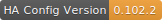

# Home Assistant Configuration Files 

  

    
        
        
        
       

   

# Introduction

# Automations

# Hardware Running My Home Assistant Setup:

# HA-Config
My Home Assistant Config

